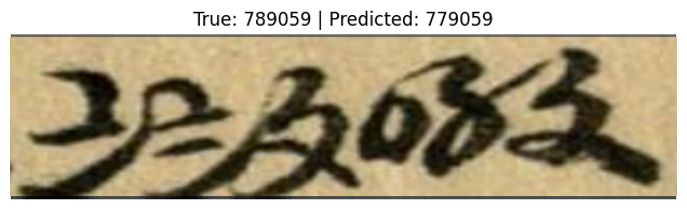

# Bringing Suzhou Numerals into the Digital Age: A Dataset and Recognition Study on Ancient Chinese Trade Records

[**ALP 2025**](https://www.ancientnlp.com/alp2025/) Co-located with [**NAACL2025**](https://2025.naacl.org/)

This project is based on [GitYCC/crnn-pytorch](https://github.com/GitYCC/crnn-pytorch).  
We have modified and extended the original code for Suzhou numeral recognition.

## Modifications
- Added support for Suzhou numerals
- Adjusted model parameters for our dataset
- Enhanced data preprocessing and augmentation

## Abstract

Suzhou numerals, a specialized numerical notation system historically used in Chinese commerce and accounting, played a pivotal role in financial transactions from the Song Dynasty to the early 20th century. Despite their historical significance, they remain largely absent from modern OCR benchmarks, limiting computational access to archival trade documents. This paper presents a curated dataset of 773 expert-annotated Suzhou numeral samples extracted from late Qing-era trade ledgers. We provide a statistical analysis of character distributions, offering insights into their real-world usage in historical bookkeeping. Additionally, we evaluate baseline performance with a handwritten text recognition (HTR) model, highlighting the challenges of recognizing low-resource brush-written numerals. By introducing this dataset and initial benchmark results, we aim to facilitate research in historical documentation in ancient Chinese characters, advancing the digitization of early Chinese financial records.

## Dataset Source
The dataset used in this project is derived from historical trade ledgers. Below is an example image from our data source:  

  

**Description**: Excerpt from a late Qing-era accounting ledger (dated the 4th year of Emperor Guangxu’s reign), preserved in the Hechang Firm in Nagasaki (*長崎和昌號*) archives.

## Example of Model Prediction
Below is an example illustrating a misprediction by our CRNN with CTC loss model:  



**Description**: An example of misprediction. The lowest stroke of the second character '〨' and the top left stroke of the third character '〩' are almost connected. As a result, our model identifies these two strokes as a single stroke and mistakenly recognizes the second character as '〧'.

## Installation & Usage

### Install Dependencies
First, create virtual environment and install the required Python packages from `requirements.txt`:

```bash
# clone this repo
git clone https://github.com/morris0401/Suzhou-Numerals-Sequence-Recognition.git
cd NaRCan

# create environment
conda create -n suzhou_numeral python=3.9
conda activate suzhou_numeral
pip install -r requirements.txt
```

### Running the Program
To train and evaluate the model, run `src/main.py` with the following command:

```bash
python src/main.py --image_dir ./data --batch_size 32 --num_epochs 20 --lr 1e-4 \
    --rotation_degree 20 --brightness 0 --contrast 0 --saturation 0 \
    --normalize_mean 0.5 --normalize_std 0.5
```

### Argument Options
The script supports the following command-line arguments:

| Argument | Type | Default | Description |
|----------|------|---------|-------------|
| `--image_dir` | `str` | `./data` | Path to the dataset directory. |
| `--batch_size` | `int` | `32` | Batch size for training. |
| `--num_epochs` | `int` | `20` | Number of training epochs. |
| `--lr` | `float` | `1e-4` | Learning rate. |
| `--rotation_degree` | `int` | `20` | Rotation degree for data augmentation. |
| `--brightness` | `float` | `0` | Brightness range for augmentation. |
| `--contrast` | `float` | `0` | Contrast adjustment for augmentation. |
| `--saturation` | `float` | `0` | Saturation adjustment for augmentation. |
| `--normalize_mean` | `float` | `0.5` | Normalization mean. |
| `--normalize_std` | `float` | `0.5` | Normalization standard deviation. |

You can modify these parameters as needed to adjust training and preprocessing behavior.

### Example Usage
```bash
python src/main.py --image_dir ./custom_dataset --batch_size 64 --num_epochs 30
```

## License
This project is licensed under the MIT License. See the `LICENSE` file for details.

## Original Repository
The original implementation can be found at:  
🔗 [GitYCC/crnn-pytorch](https://github.com/GitYCC/crnn-pytorch)

## Acknowledgment
This project is based on [GitYCC/crnn-pytorch](https://github.com/GitYCC/crnn-pytorch), which is licensed under the MIT License.
